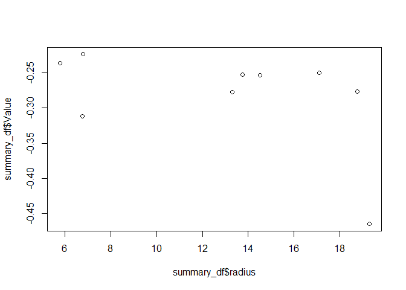

<div align="center">


</div>

# tpiscaleR

## Terminology

#### TPI:

The topographic position index is a scale-dependent terrain index.
Positiv values indicate a convex and therefore exposed position. Negativ
values indicate a concave position. Because of its scale dependency, its
hard to determine the right radius for the TPI. In most cases, the TPI
will be used to model another environmental variable like soil moisture.

#### Radius:

The scale at which the TPI is computed. A radius of 5 e.g. compares the
center pixel with the pixels at an 5m radius.

#### Target Raster:

A one-layered SpatRaster showing the target variable, e.g. soil
moisture, NDVI, snow depth.

#### DSM:

The digital elevation model thats used to calculate the TPI.

## Key features

With this package its possible:

- to evaluate the correlation of TPI at an specific radius to the target
  raster. Instead of computing the TPI for the whole DSM, it only uses a
  certain number of points to evaluate the correlation. This can safe a
  lot of time. The function is called tpi_sample.

- to find the “best radius” with the highest correlation to the target
  raster using a bayesian optimaziation. The function is called tpi_opt.

## Requirements

- terra package (to handle the raster data)
- rBayesianOptimization

## Example 1 (testing one specific scale / tpi_sample)

Given we want to research the snowdepth and its relationship to the TPI
and we want to check out the spearman correlation of a given TPI radius
(15 meters). In this case we use 50 pixels to estimate the correlation.

``` r
dem <- terra::rast("C:/Users/miles/OneDrive/Dokumente/danieldüsentrieb/dsm_snowfree.tif")
snowdepth <- terra::rast("C:/Users/miles/OneDrive/Dokumente/danieldüsentrieb/snowdepth.tif")

spearman_15m <- tpiscaleR::tpi_sample(dem, snowdepth, 50, 15, relationship = "spearman")
```

    ## |---------|---------|---------|---------|=========================================                                          [1] "spearman correlation between tpi at scale  15  =  -0.125858343337335"

``` r
print(spearman_15m$Score)
```

    ## [1] 0.1258583

## Example 2 (Optimizing the tpi radius using bayesianOptimatziation)

Given we want to research the snowdepth and its relationship to the TPI
and we want to find out the optimalTPI radius. Because we expect a non
linear relationship we pick the RSME of a linear regression as the to be
optimized correlation coefficient. We try to find out the optimal radius
between 5 and 25 meters using a sample of 55 pixels for each radius. We
use 5 bayesian iterations and a kappa of 3. Because the bayesian
optimization only look for the highest value, the rmse is always
negative .

``` r
dem <- terra::rast("C:/Users/miles/OneDrive/Dokumente/danieldüsentrieb/dsm_snowfree.tif")
snowdepth <- terra::rast("C:/Users/miles/OneDrive/Dokumente/danieldüsentrieb/snowdepth.tif")

optimal_radius <- tpiscaleR::tpi_opt(5, 25, dem, snowdepth, 55, 5, 3, correlation_coefficient = "rmse_linear")
```

    ## [1] "The value in the following output is the absolute or negative value of the choosen relationship/method (such as pearson, spearman, rsme_linear, r2_quad...)"
    ## elapsed = 37.40  Round = 1   radius = 14.59838   Value = -0.6457195 
    ## elapsed = 44.11  Round = 2   radius = 17.91347   Value = -0.5166894 
    ## elapsed = 21.37  Round = 3   radius = 7.77273    Value = -0.4024807 
    ## elapsed = 34.81  Round = 4   radius = 15.83383   Value = -0.2499954 
    ## elapsed = 54.61  Round = 5   radius = 21.94572   Value = -0.2613865 
    ## elapsed = 34.72  Round = 6   radius = 15.67755   Value = -0.4909993 
    ## elapsed = 42.51  Round = 7   radius = 18.90614   Value = -0.2109633 
    ## elapsed = 37.74  Round = 8   radius = 16.87917   Value = -0.2030989 
    ## elapsed = 49.15  Round = 9   radius = 20.86216   Value = -0.2444369 
    ## 
    ##  Best Parameters Found: 
    ## Round = 8    radius = 16.87917   Value = -0.2030989

``` r
summary_df <- optimal_radius$History
plot(summary_df$radius, summary_df$Value)
```

<!-- -->
